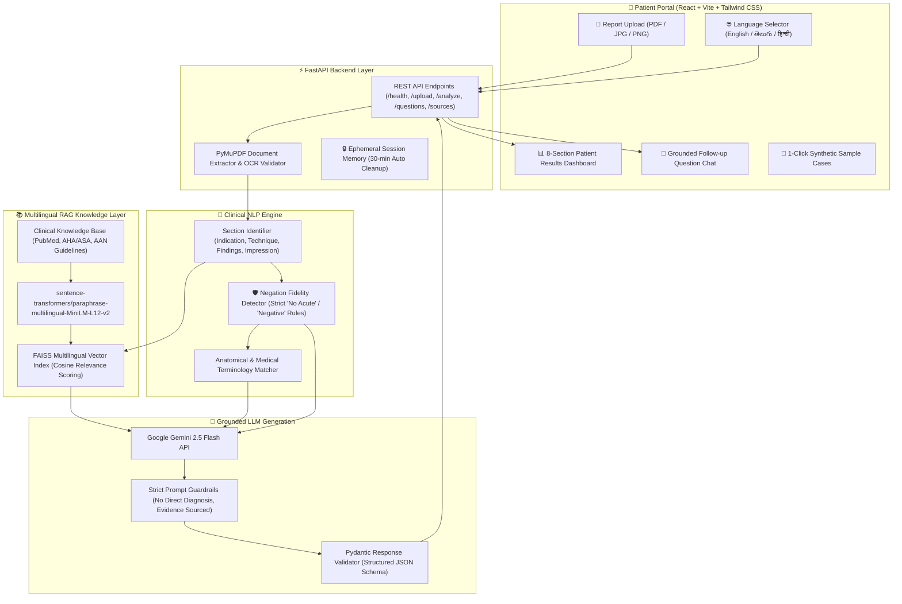

# 🧠 NeuroExplain — Multilingual Neurological Report Interpretation Portal

> **Medical information explained in words you understand.**
> A patient-facing healthcare application bridging the communication gap between complex neurological diagnostic reports (Brain MRI, EEG, EMG/NCS) and patients in **English**, **Telugu (తెలుగు)**, and **Hindi (हिन्दी)** using Natural Language Processing (NLP), Multilingual Retrieval-Augmented Generation (RAG), and Google Gemini 2.5 Flash.

---

## 🏥 Project Overview & Mission

Neurological diagnostic reports (such as Brain MRI scans, routine EEGs, and Electromyography studies) are filled with dense clinical jargon, Latin anatomical terms, and radiological shorthand. Patients receiving these reports often feel severe anxiety, misinterpret benign incidental findings as fatal conditions, or invert critical negative findings (for example, mistaking *"No evidence of acute territorial infarction"* for an active stroke).

**NeuroExplain** provides a hospital-grade, multilingual patient portal that:
1. **Preserves Medical Meaning & Negation Fidelity**: Automatically detects negated findings so normal results are never misrepresented as illness.
2. **Grounds Explanations in Real Literature (RAG)**: Retrieves peer-reviewed clinical guidelines (from PubMed, American Heart Association / American Stroke Association, American Academy of Neurology) using multilingual vector embeddings and FAISS before generating explanations.
3. **Explains in Everyday Language**: Uses Google Gemini 2.5 Flash to generate compassionate, patient-friendly summaries and everyday analogies across English, Telugu, and Hindi.
4. **Protects Patient Safety & Privacy**: Operates entirely in temporary session memory with automatic 30-minute purging and clear visual safety protocols distinguishing written text reports from raw imaging scans.

---

## 🏗️ System Architecture



---

## 🛠️ Technology Stack & Simple Explanations

| Technology | Role in NeuroExplain | Why It Was Chosen (Simple Language) |
| :--- | :--- | :--- |
| **Python** | Backend Language | The industry standard for AI, machine learning, medical NLP, and vector search. |
| **Google Gemini 2.5 Flash** | Large Language Model (LLM) | Fast, compassionate reasoning that converts complex medical facts into patient-friendly explanations in English, Telugu, and Hindi. |
| **LangChain** | RAG Framework | Orchestrates the flow between document text, knowledge retrieval, and prompt generation. |
| **Sentence Transformers** | Multilingual Embeddings (`paraphrase-multilingual-MiniLM-L12-v2`) | Translates sentences into numbers (vectors) in a shared mathematical space so that a question in Telugu or Hindi can retrieve English medical guidelines. |
| **FAISS** | Vector Database | Ultra-fast similarity search engine developed by Meta that finds the most relevant clinical guideline passages in milliseconds. |
| **FastAPI** | Backend Web Framework | High-performance asynchronous Python web framework with automatic OpenAPI documentation and strict data validation. |
| **React + Vite** | Frontend Framework | Fast, modern web user interface offering smooth real-time interactivity for patients. |
| **Tailwind CSS** | Styling System | Provides a calm, clean, accessible hospital-grade aesthetic (teal and navy blue palette) without clutter. |
| **PyMuPDF (`fitz`)** | PDF Text Extraction | Robust engine to extract text, preserve page numbers, and inspect document layout. |
| **PaddleOCR / PIL** | Image Processing & OCR | Extracts text from scanned photos of reports and differentiates between text documents and raw medical scan slices. |
| **Pydantic** | Schema Validation | Guarantees that all API inputs and AI outputs follow strict, type-safe clinical response structures. |
| **Pytest** | Testing Suite | Automated tests verifying PDF parsing, negation preservation, cross-lingual retrieval, and API endpoints. |

---

## 📋 Results Dashboard Sections

When an analysis is completed, NeuroExplain organizes findings into 8 clear, patient-friendly sections:

1. **A. Report Summary**: A 2-3 paragraph plain-language overview of what the test shows.
2. **B. Important Findings**: Exact findings from the report, highlighting normal/negated findings with clear reassurance badges.
3. **C. Medical Terms Explained**: Plain-language explanations of difficult terminology, with relatable real-life analogies and an interactive *"Explain More Simply"* tool.
4. **D. What These Findings May Mean**: Educational interpretations grounded directly in peer-reviewed clinical guidelines.
5. **E. What Is Uncertain**: Specific aspects that cannot be determined from the report alone without clinical correlation with your doctor.
6. **F. Questions for Your Doctor**: Actionable, high-yield questions tailored specifically to the patient's report for their next consultation.
7. **G. Trusted Clinical Sources**: Real, verified PubMed literature, practice bulletins, and guideline citations with title, publisher, DOI/URL, and retrieved excerpts.
8. **H. Suggested Next Steps**: Practical, reassuring guidance to schedule a review with the treating physician.

---

## 🔒 Patient Privacy & Clinical Safety Protocols

- **Temporary Session Processing**: All uploaded report files are processed in ephemeral memory and automatically deleted immediately after text extraction. In-memory data expires automatically after 30 minutes.
- **Negation Preservation Guarantee**: The NLP pipeline strictly flags sentences like *"No evidence of acute territorial infarction"* or *"Negative for hemorrhage"* as negated, preventing dangerous hallucinated inversions.
- **Medical Scan vs Report Safety Distinction**: If a user uploads a raw radiographic scan image (e.g., MRI DICOM slice or CT slice) without a written report, NeuroExplain presents a prominent safety notice explaining that direct image interpretation requires a certified radiologist.
- **Brain Mass / Tumor Safety**: Suspected extra-axial or intra-axial masses are explained as imaging findings requiring multidisciplinary review and biopsy; the system never makes premature malignancy diagnoses or prognosis predictions.
- **Medical Disclaimer**: Visible on every screen, emphasizing that NeuroExplain provides educational understanding and does not replace professional medical diagnosis.

---

## 🚀 Setup & Execution Guide

### Prerequisites
- Python 3.12+
- Node.js 18+ and npm
- A Google Gemini API Key

### 1. Backend Setup

```bash
# Navigate to backend directory
cd NeuroExplain/backend

# Create and activate Python virtual environment
python3.12 -m venv venv
source venv/bin/activate

# Install dependencies
pip install -r requirements.txt

# Configure environment variables
cp .env.example .env
# Edit .env and set your GEMINI_API_KEY
```

### 2. Frontend Setup

```bash
# In a new terminal, navigate to frontend directory
cd NeuroExplain/frontend

# Install node dependencies
npm install

# Start development server
npm run dev
```

The frontend will start at `http://localhost:5173`.

### 3. Running the FastAPI Backend

```bash
cd NeuroExplain/backend
source venv/bin/activate
uvicorn app.main:app --host 0.0.0.0 --port 8000 --reload
```

Interactive API documentation (Swagger UI) is available at:
`http://localhost:8000/docs`

### 4. Running Automated Tests

```bash
cd NeuroExplain/backend
source venv/bin/activate
pytest -v
```

---

## 🧪 Synthetic Clinical Demonstration Cases

NeuroExplain includes built-in synthetic clinical cases with zero Personally Identifiable Information (PII) for immediate one-click testing:

1. **Brain MRI — White Matter Changes & Migraines**: 48-year-old female with tension headaches. Demonstrates frontal T2/FLAIR hyperintensities with preserved negation (*No acute infarction*).
2. **Brain MRI — Suspected Mass (Safety Protocol Case)**: 61-year-old male with extra-axial dural-based mass. Demonstrates oncology safety protocols and biopsy differential.
3. **Routine 30-Minute Video EEG**: 34-year-old evaluated for lightheadedness. Demonstrates normal 10 Hz posterior dominant alpha rhythm with photic driving.
4. **EMG & Nerve Conduction Study (NCS)**: 42-year-old with nocturnal hand numbness. Demonstrates right median neuropathy at the carpal tunnel.

---

## 🌐 Multilingual Demonstration Examples

| Language | Report Summary Example | Medical Term Analogy |
| :--- | :--- | :--- |
| **English** | "Your Brain MRI shows normal brain structures with no signs of fresh stroke or bleeding. Minor punctate spots in the frontal lobes represent normal age or migraine-related changes." | *T2/FLAIR Hyperintensities*: "Like tiny areas of natural wear and tear on insulation wire, commonly seen with aging or headaches." |
| **తెలుగు (Telugu)** | "మీ బ్రెయిన్ MRI నివేదికలో మెదడు నిర్మాణం సాధారణంగా ఉంది. ఎటువంటి తాజా స్ట్రోక్ లేదా రక్తస్రావం లేదని నిర్ధారించబడింది. కనిపించిన చిన్న తెల్లటి చుక్కలు మైగ్రేన్ లేదా వయస్సు సంబంధిత మార్పులు." | *వైట్ మ్యాటర్ మార్పులు*: "విద్యుత్ వైర్ల ఇన్సులేషన్‌పై కాలక్రమేణా వచ్చే చిన్నపాటి అరుగుదల వంటివి." |
| **हिन्दी (Hindi)** | "आपकी ब्रेन MRI रिपोर्ट दर्शाती है कि मस्तिष्क में कोई ताजा स्ट्रोक या रक्तस्राव नहीं है। सामने के हिस्से में देखे गए छोटे सफेद धब्बे माइग्रेन या उम्र से संबंधित सामान्य बदलाव हैं।" | *T2/FLAIR हाइपरइंटेन्सिटी*: "जैसे बिजली के तारों के इंसुलेशन पर समय के साथ आने वाले हल्के घिसाव के निशान।" |

---

## 📄 API Reference

| Method | Endpoint | Description |
| :--- | :--- | :--- |
| `GET` | `/health` | System status, RAG index readiness, and supported languages. |
| `POST` | `/api/reports/upload` | Uploads PDF or image, extracts text, and stores in temporary session memory. |
| `POST` | `/api/reports/{id}/analyze` | Executes NLP + FAISS Retrieval + Gemini LLM generation in EN, TE, or HI. |
| `POST` | `/api/reports/{id}/questions` | Answers follow-up patient questions grounded in report and guidelines. |
| `GET` | `/api/reports/{id}/sources` | Returns verified supporting PubMed citations and literature excerpts. |
| `POST` | `/api/reports/{id}/simplify-term` | Generates a super-simple explanation and everyday analogy for a specific medical term. |
| `GET` | `/api/reports/samples` | Lists all built-in synthetic demonstration cases. |
| `POST` | `/api/reports/sample/{id}/load` | Loads a synthetic case directly into session memory. |

---

## ⚖️ Ethical & Educational Notice
NeuroExplain is developed for patient educational communication and clinical health literacy. It is designed to complement, never replace, the clinical judgment and personalized care of a certified neurologist or physician.
